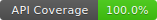

# playswag-examples

Real-world [playswag](https://github.com/MichalFidor/playswag) usage against the official
[Swagger Petstore v3](https://github.com/swagger-api/swagger-petstore) API.

This repo is both a **showcase** of every playswag feature and a **tutorial** you can follow
step-by-step to add API coverage tracking to your own Playwright test suite.

[](./playswag-report/playswag-coverage.md)

---

## What you'll see

| Dimension | Spec total | Achieved | Target |
|-----------|-----------|---------|--------|
| Endpoints | 19 | 19/19 — **100 %** | ≥ 80 % |
| Status codes | 40 | 22/40 — **55 %** | ≥ 55 % |
| Parameters | 17 | 17/17 — **100 %** | — |
| Body properties | 38 | 30/38 — **79 %** | — |
| Response properties | 63 | 41/63 — **65 %** | — |

Running all three test files (pets, store, user) should pass the configured thresholds.
Running only `pets.spec.ts` demonstrates what a partial suite looks like — lower scores,
thresholds fail, CI exits non-zero.

---

## Prerequisites

- **Node.js 20+** (or use `nvm use`)
- **Docker** with the Compose plugin (`docker compose version`)

---

## Quick start

```bash
# 1. Clone
git clone https://github.com/MichalFidor/playswag-examples.git
cd playswag-examples

# 2. Install
npm install
npx playwright install --with-deps

# 3. Run tests + generate coverage
#    global-setup.ts starts the Petstore Docker container automatically
npm test
```

After the run, open `playswag-report/playswag-coverage.html` in your browser to explore
the interactive coverage report.

---

## Step-by-step tutorial

### 1. Install playswag

```bash
npm install --save-dev @michalfidor/playswag
```

### 2. Register the reporter in `playwright.config.ts`

```ts
import { defineConfig } from '@playwright/test';

export default defineConfig({
  reporter: [
    ['@michalfidor/playswag/reporter', {
      specs: './specs/petstore.json',   // path(s) to your OpenAPI spec
      outputDir: './playswag-report',
      outputFormats: ['console', 'html', 'markdown', 'badge'],
    }],
  ],
});
```

That's it — no changes to your tests are needed.

### 3. Point `use.baseURL` at the API root

```ts
use: {
  baseURL: 'http://localhost:8080/api/v3',
},
```

playswag reads the `servers[0].url` from your spec (also `http://localhost:8080/api/v3`)
and strips that prefix automatically before matching recorded URLs to spec paths.
Your tests call `request.get('/pet')` and everything resolves correctly.

### 4. Run and read the report

```
┌─────────────────────────────────────────────────────────────┐
│  [playswag] API Coverage Report                             │
├──────────────────┬────────┬──────────┬──────────────────────┤
│  Dimension       │ Covered│   Total  │  Coverage            │
├──────────────────┼────────┼──────────┼──────────────────────┤
│  Endpoints       │  17    │   19     │  89.5 %  ████████▓░  │
│  Status codes    │  19    │   35     │  54.3 %  █████▒░░░░  │
│  Parameters      │  13    │   20     │  65.0 %  ██████▓░░░  │
│  Body properties │  14    │   30     │  46.7 %  ████▓░░░░░  │
│  Response props  │  28    │   30     │  93.3 %  █████████▓  │
└──────────────────┴────────┴──────────┴──────────────────────┘
```

### 5. Set thresholds to enforce coverage in CI

```ts
reporter: [
  ['@michalfidor/playswag/reporter', {
    // ...
    threshold: {
      endpoints:   { min: 80, fail: true },
      statusCodes: { min: 55, fail: true },
    },
    failOnThreshold: true,
  }],
],
```

When a threshold is violated playswag exits with code 1, failing the CI job.

### 6. Track coverage over time with history

```ts
reporter: [
  ['@michalfidor/playswag/reporter', {
    // ...
    history: { enabled: true, maxEntries: 30 },
  }],
],
```

After each run `playswag-report/playswag-history.json` gains a new entry. The console
output will show a `Δ` delta column so you can see coverage trends at a glance.

---

## Repo layout

```
specs/
  petstore.json          – vendored OAS3 spec (see specs/README.md)
  README.md

tests/
  pets.spec.ts           – pet tag: 8 operations, all params + body shapes
  store.spec.ts          – store tag: 4 operations
  user.spec.ts           – user tag: 7 operations

scripts/
  refresh-spec.mjs       – re-downloads the live spec from the running container

.github/
  workflows/
    ci.yml               – GitHub Actions: test on push + daily schedule

playwright.config.ts     – full annotated reporter configuration
docker-compose.yml       – swaggerapi/petstore3 on port 8080

playswag-report/         – generated, committed: badge, markdown, html
  playswag-badge.svg
  playswag-coverage.md
  playswag-coverage.html  (committed — self-contained, no external dependencies)
  playswag-history.json   (not committed — local history only)
```

---

## Refreshing the vendored spec

If the container image is updated and you want to re-vendor the spec:

```bash
docker compose up -d
npm run refresh-spec
git add specs/petstore.json
git commit -m "chore: refresh petstore spec"
```

---

## CI badge

The badge in this README points to a committed SVG that the CI workflow updates on every
successful `main` push.  Copy the pattern to your own repo:

```md
[](./playswag-report/playswag-coverage.md)
```

---

## License

MIT
